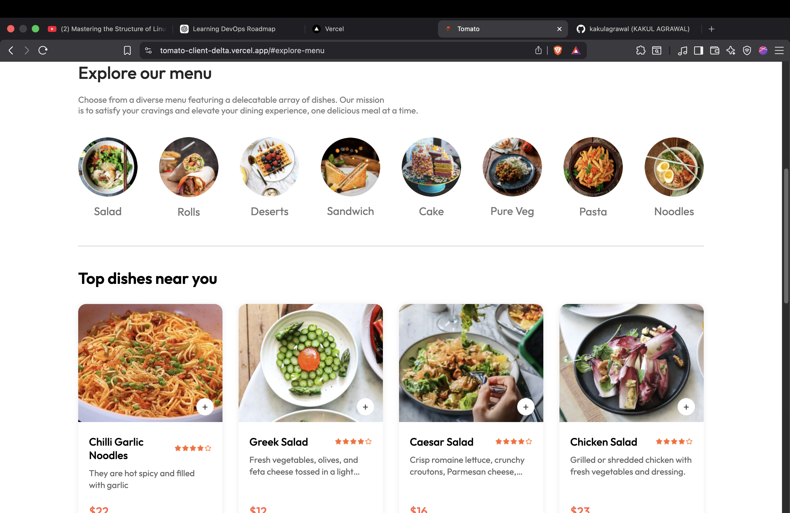
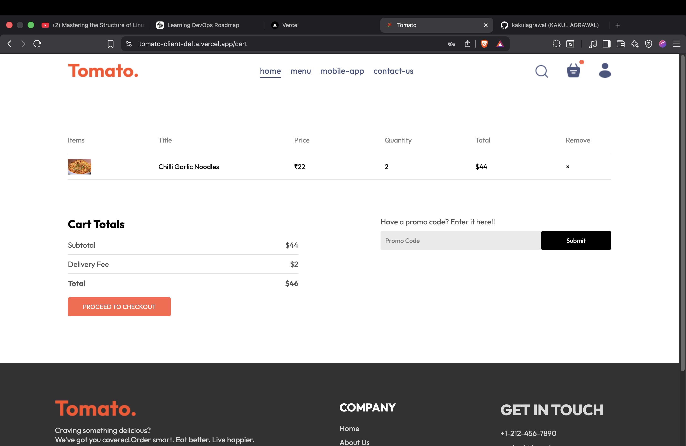
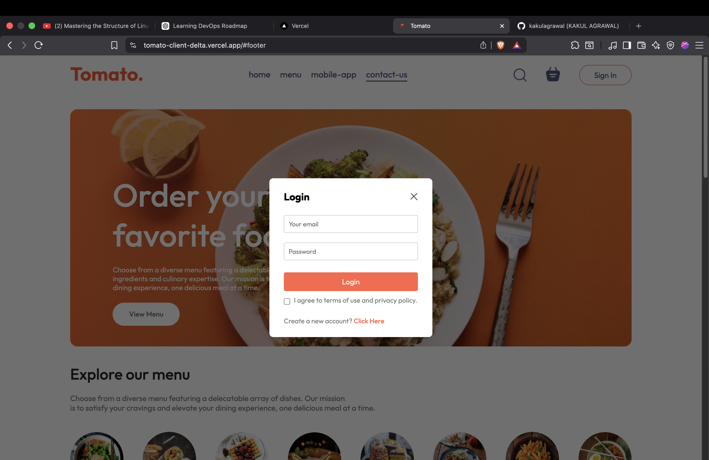
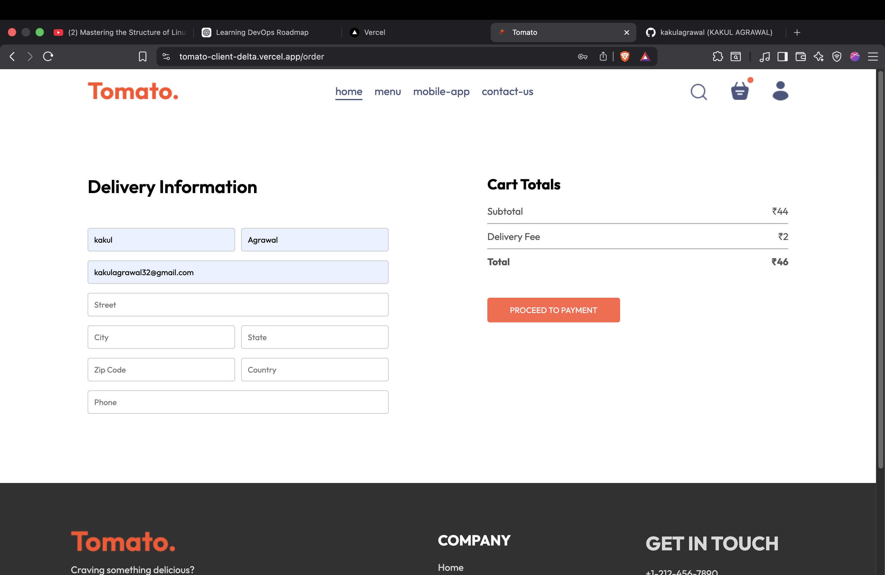
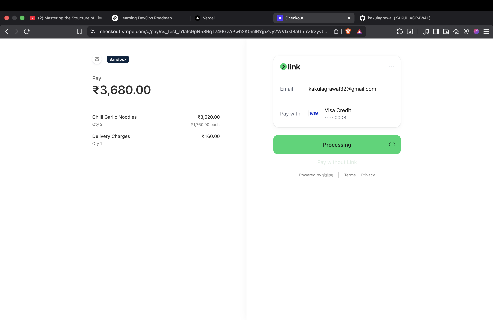

# 🍅 Tomato - Food Delivery Website

Tomato is a full-stack food ordering web application inspired by modern food delivery platforms.
It allows users to browse food items, manage their cart, place orders, and make secure online payments. 
The project includes a customer-facing website, an admin dashboard for managing food items and orders, and a RESTful backend API.

## 🌐 Live Demo

* **Frontend:** https://tomato-client-delta.vercel.app/
* **Backend API:** https://tomato-backend-z7id.onrender.com/
* **Admin Dashboard:** https://tomato-full-stack-project-flame.vercel.app/add

## 📸 Screenshots

### Home


### Menu


### Cart


###Login


###Delivery


###Payment



## ✨ Features

### 👤 User Features

* Browse food items by category
* Search and explore the menu
* Add and remove items from the cart
* User authentication
* Place food orders
* Online payment integration
* View order history
* Responsive design for desktop and mobile

### 🛠️ Admin Features

* Secure admin login
* Add new food items
* Update existing food items
* Delete food items
* Upload food images
* Manage customer orders
* Update order status

## 🛠️ Tech Stack

### Frontend

* React
* Vite
* CSS
* Axios
* React Router DOM

### Backend

* Node.js
* Express.js
* MongoDB
* Mongoose
* JWT Authentication
* Multer
* Cloudinary
* Stripe

## 📂 Project Structure

```text
Tomato
├── frontend
│   ├── src
│   ├── public
│   └── package.json
│
├── admin
│   ├── src
│   └── package.json
│
└── backend
    ├── config
    ├── controllers
    ├── middleware
    ├── models
    ├── routes
    ├── uploads
    └── package.json
```

## 🚀 Getting Started

### Clone the Repository

```bash
git clone <repository-url>
cd Tomato
```

### Install Dependencies

#### Frontend

```bash
cd frontend
npm install
```

#### Admin

```bash
cd ../admin
npm install
```

#### Backend

```bash
cd ../backend
npm install
```

## ⚙️ Environment Variables

Create a `.env` file inside the backend directory.

```env
PORT=4000

MONGODB_URI=YOUR_MONGODB_URI

JWT_SECRET=YOUR_SECRET_KEY

STRIPE_SECRET_KEY=YOUR_STRIPE_SECRET_KEY

CLOUDINARY_CLOUD_NAME=YOUR_CLOUD_NAME
CLOUDINARY_API_KEY=YOUR_API_KEY
CLOUDINARY_API_SECRET=YOUR_API_SECRET
```

## ▶️ Run the Project

### Start Backend

```bash
cd backend
npm run server
```

### Start Frontend

```bash
cd frontend
npm run dev
```

### Start Admin Panel

```bash
cd admin
npm run dev
```


## 🔮 Future Improvements

* Wishlist functionality
* Food search with filters
* User profile management
* Coupon and discount system
* Real-time order tracking
* Email notifications
* Order analytics dashboard

## 👨‍💻 Author

**Kakul Agrawal**

Passionate Full Stack Developer focused on building scalable, user-friendly web applications and continuously learning new technologies.

## ⭐ Support

If you found this project helpful, consider giving it a ⭐ on GitHub!
